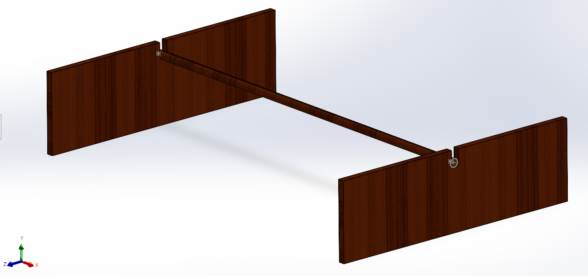
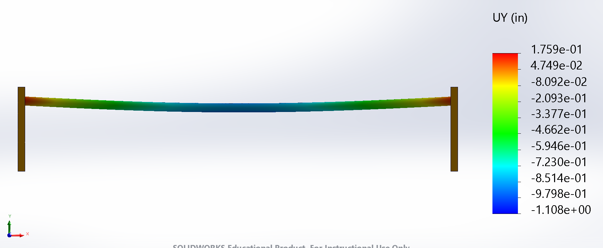
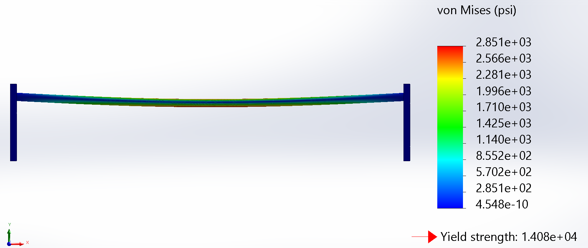

# Closet Rod Structural Analysis

Structural analysis of a household teakwood closet rod using classical beam theory, Python, SolidWorks CAD, and finite element analysis.

The project evaluates whether a **1.25 in diameter teakwood rod spanning 60.5 in** can adequately support an estimated **71.75 lbf clothing load**, with particular attention to both bending strength and deflection.

## Project Overview

A household closet rod was modeled as a simply supported circular beam subjected to a uniformly distributed clothing load. Analytical beam calculations were first used to estimate reactions, bending stress, factor of safety, and vertical deflection.

A Python calculation tool was then developed to automate the analytical model and allow rapid comparison of different rod geometries and loading conditions.

Finally, a SolidWorks Simulation model was created to evaluate the rod using more realistic support geometry and contact conditions.

## Key Results

| Quantity                                | Analytical | SolidWorks FEA |
| --------------------------------------- | ---------: | -------------: |
| Total Load                              |  71.75 lbf |      71.75 lbf |
| Reaction per Support                    | 35.875 lbf |     35.875 lbf |
| Maximum Bending Stress                  |  2.830 ksi |      2.847 ksi |
| Maximum Vertical Deflection             |   0.969 in |       1.108 in |
| Factor of Safety vs. Modulus of Rupture |       4.98 |           4.95 |

The analytical and FEA stress predictions differed by less than 1%, supporting the use of the simplified beam model for estimating global bending stress.

However, both approaches predicted excessive vertical deflection compared with the selected **L/240 serviceability limit of 0.252 in**.

### Main Conclusion

**Deflection and long-term serviceability govern the design rather than immediate bending failure.**

The rod has a relatively high margin against bending rupture, but its long span and limited stiffness result in significant predicted sag.

## Analytical Model

The rod was idealized as a simply supported beam under a uniformly distributed load.

Key inputs:

* Material: Teakwood
* Rod diameter: 1.25 in
* Effective span: 60.5 in
* Estimated clothing load: 71.75 lbf
* Distributed load: 1.186 lbf/in
* Elastic modulus: 1.781 × 10⁶ psi
* Modulus of rupture: 14,080 psi

Classical beam equations were used to calculate:

* support reactions;
* maximum bending moment;
* maximum bending stress;
* factor of safety relative to bending rupture;
* maximum vertical deflection;
* approximate rupture load;
* load corresponding to the L/240 serviceability limit.

## Python Calculation Tool

A Python script was developed to automate the beam calculations.

The program accepts the primary geometry, loading, material properties, and FEA comparison values as inputs and calculates the structural response automatically.

This allows design variables such as rod diameter, unsupported span, and applied load to be changed quickly without repeating the full calculation process manually.

See [`analysis/closet_rod_analysis.py`](analysis/closet_rod_analysis.py).

## SolidWorks FEA

A SolidWorks assembly was created containing the closet rod and two open-top wooden bearing supports.

The static simulation incorporated:

* distributed vertical loading;
* fixed rear surfaces of the support inserts;
* rod-to-support contact interactions;
* local mesh refinement near contact regions;
* simplified isotropic teakwood material properties.

The FEA model predicted a maximum vertical displacement of **1.108 in**.

A representative midspan axial stress of **2.847 ksi** was obtained, closely matching the analytical prediction of **2.830 ksi**.

## Engineering Interpretation

The close agreement between the analytical and numerical stress results indicates that classical beam theory provides a useful first-order estimate of global bending behavior.

Deflection showed greater sensitivity to modeling assumptions because the physical support condition is more complicated than an ideal simply supported boundary.

The analysis indicates that increasing **stiffness** would be more beneficial than simply increasing material strength.

Potential design improvements include:

* adding a center support;
* reducing the unsupported span;
* increasing rod diameter.

Because beam deflection varies strongly with span length, adding a center support would provide a particularly large reduction in sag.

## Model Limitations

This project is intended as a first-order engineering assessment rather than an exact prediction of wood behavior.

Important simplifications include:

* teakwood modeled as homogeneous and isotropic;
* uniform rather than discrete hanger loading;
* static loading only;
* idealized material properties;
* simplified support geometry;
* no direct time-dependent creep simulation;
* no detailed anisotropic wood failure model.

Real wood behavior depends on grain direction, moisture content, defects, age, and other factors not captured by the model.

## Tools Used

* SolidWorks
* SolidWorks Simulation
* Python
* Mechanics of Materials / Beam Theory
* Microsoft Excel
* Technical Documentation

## Full Report

The complete methodology, calculations, assumptions, figures, references, and discussion are available in:

[`report/Closet_Rod_Analysis_Report.pdf`](report/closet-rod-analysis-report.pdf)
